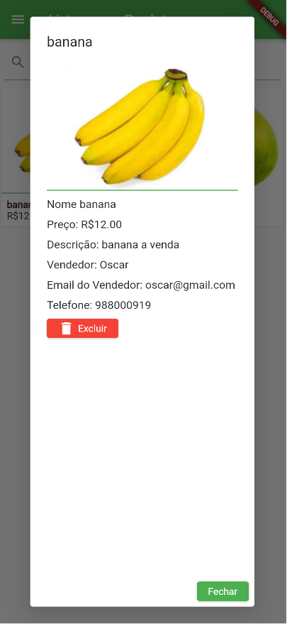
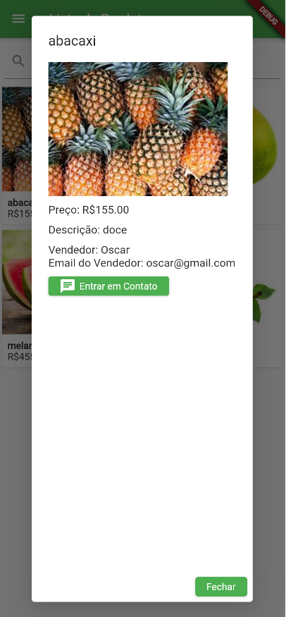

# E-commerce Agro

Este é um aplicativo `mobile desenvolvido em Flutter`, com o objetivo de conectar comerciantes e compradores de produtos agropecuários. 

## Demonstração em Vídeo

[Demonstração em Vídeo](https://drive.google.com/file/d/1ux4afBfVzdPsYQUhPAnE1sqjJW7o0m8M/view?usp=sharing)

Clique na imagem acima para assistir à `demonstração em vídeo`.

## Exibição da aplicação








## A seguir está o Repositório da API

[Link da API](https://github.com/Wenderson-Oscar/api_ecommerce_agro)

## Tutorial de como utilizar

Iremos `clonar` o repositório:

```
git clone https://github.com/Wenderson-Oscar/E-Commerce_Agro.git
```

No terminal, execute o seguinte comando para `instalar as dependências`:

```
flutter pub get
```

...

Depois de configurar a `API` e iniciar o servidor no link acima, execute o seguinte comando para iniciar o aplicativo:

```
flutter run -d chrome
```
